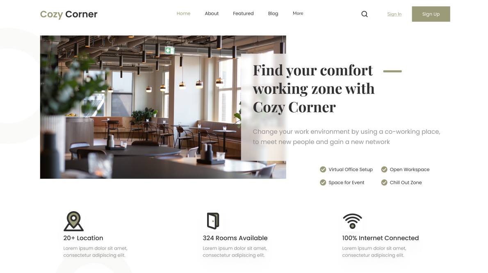

# Coworking Space
- En este proyecto no se utilia ni Sass ni vite, se parte de la base de una simple carpeta boilerplate de Html5.    

- Se diseña la vista de escritorio de un header de espacio de coworking.

