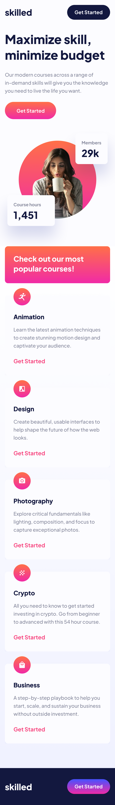
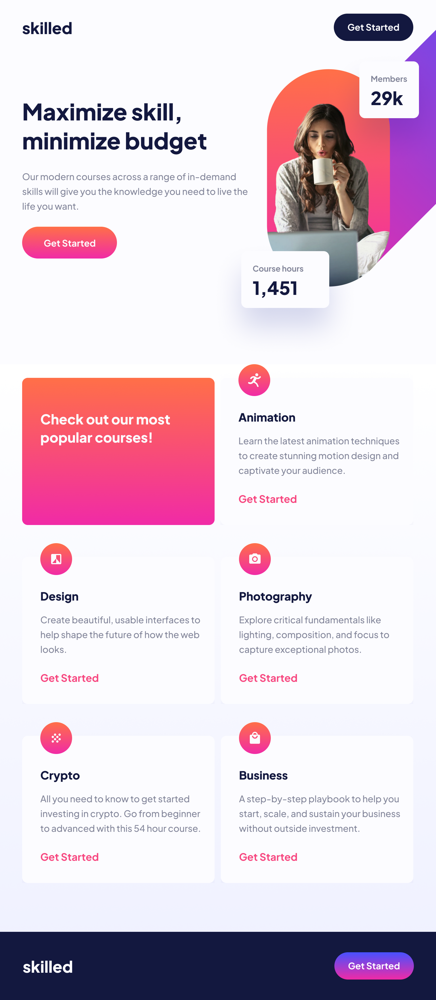
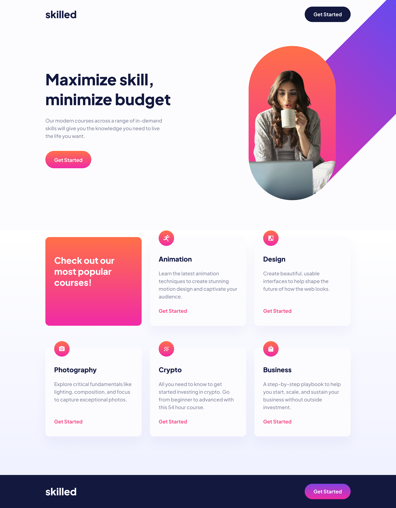

# Elearning Landing Page

- Este proyecto es un proyecto responsive en 5 tamaños (mobile, tablet, tablethorizontal, desktop, desktopxl).
- Diseñamos una Landing page de una página de Elearning, usando Sass como hojas de estilos.

