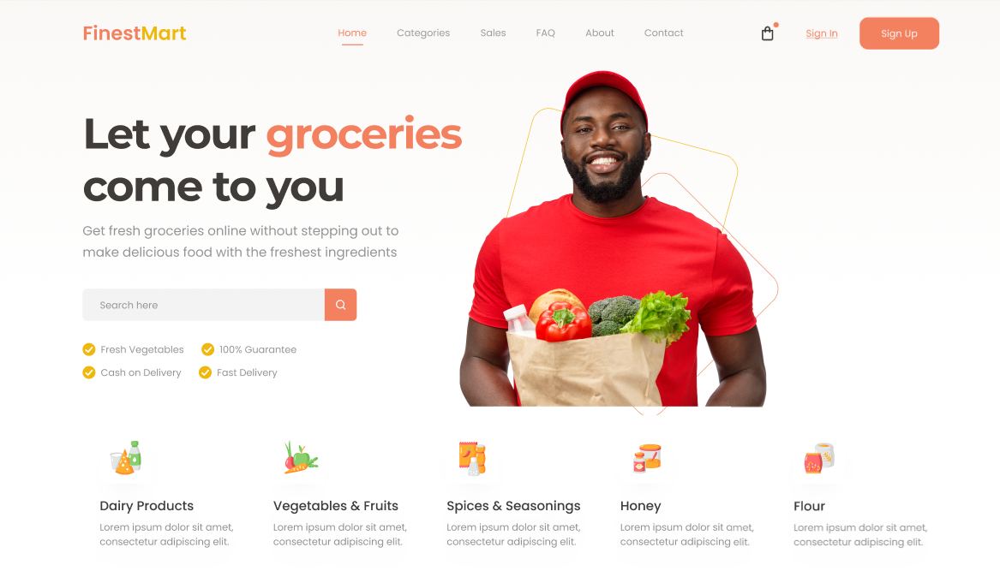

# Grocery Store

- En este proyecto programamos el header de un pàgina de una grocery store en vista de escritorio.
- Se usa una boilerplate de sass con una estructura de carpetas para tener todo  el codigo scss organizado. En concreto la bolierplate que se usa es la que hay en el inicio del respositorio, llamada base_proyectos.

[Ir a la bolierplate](../base_proyectos)

